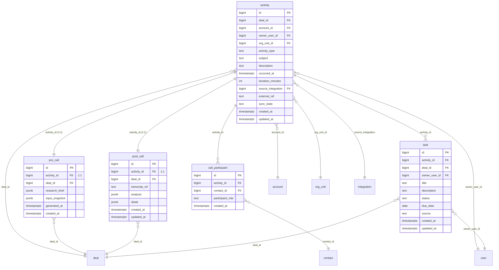

# Domain: Activity & Call

Focused ER diagram for the **Activity & Call** domain (5 tables). `activity` is the
hub: `pre_call` and `post_call` are 1:1 extensions, `call_participant` and `task`
are 1:many children.

**Tables:** `activity`, `pre_call`, `post_call`, `call_participant`, `task`

## Internal relationships
- `pre_call` → `activity` (activity_id, **1:1**)
- `pre_call` → `deal` (deal_id) — cross-domain
- `post_call` → `activity` (activity_id, **1:1**)
- `post_call` → `deal` (deal_id) — cross-domain
- `call_participant` → `activity` (activity_id)
- `call_participant` → `contact` (contact_id) — cross-domain
- `task` → `activity` (activity_id)
- `task` → `deal` (deal_id) — cross-domain
- `task` → `user` (owner_user_id) — cross-domain

## Cross-domain relationships
- `activity.deal_id` → `deal` (Customer)
- `activity.account_id` → `account` (Customer)
- `activity.owner_user_id` → `user` (Identity & Org)
- `activity.org_unit_id` → `org_unit` (Identity & Org)
- `activity.source_integration` → `integration` (Integration)
- `activity` is referenced by: `scorecard.activity_id` (1:1),
  `coaching_reflection.activity_id`, `ai_run.activity_id`
- `post_call` is referenced by: `product_signal.post_call_id`

## Notes
- The two **1:1** relations (`pre_call`, `post_call` to `activity`) are enforced via
  a unique constraint on the FK column plus a NOT NULL — i.e. the child row cannot
  outlive its parent and there is at most one per activity.
- `activity.source_integration` is the only place an activity is tied back to an
  integration row (e.g. "came from Zoom sync"). Nullable for manually-created
  activities.
- `task` is an offshoot of `activity` (action items captured during/after a call)
  but also denormalises `deal_id` + `owner_user_id` for fast query scoping.