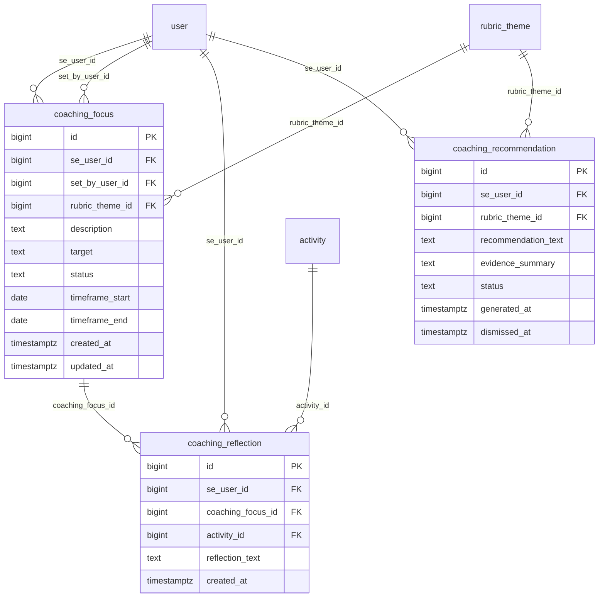

# Domain: Coaching

Focused ER diagram for the **Coaching** domain (3 tables). All three tables
reference `user` (the coached SE) and at least one table from Scoring or Activity.

**Tables:** `coaching_focus`, `coaching_reflection`, `coaching_recommendation`

## Internal relationships
- `coaching_reflection` → `coaching_focus` (coaching_focus_id) — a reflection is
  tied to the focus it relates to

## Cross-domain relationships
- `coaching_focus.se_user_id` → `user` (Identity & Org)
- `coaching_focus.set_by_user_id` → `user` (Identity & Org)
- `coaching_focus.rubric_theme_id` → `rubric_theme` (Scoring)
- `coaching_reflection.se_user_id` → `user` (Identity & Org)
- `coaching_reflection.activity_id` → `activity` (Activity & Call)
- `coaching_recommendation.se_user_id` → `user` (Identity & Org)
- `coaching_recommendation.rubric_theme_id` → `rubric_theme` (Scoring)

## Notes
- `coaching_focus` has **two** FKs to `user`: `se_user_id` (the SE being coached)
  and `set_by_user_id` (the manager/coach who set the focus). They are distinct
  relationships and may resolve to the same row only in degenerate cases.
- `coaching_recommendation` has no `created_at`; it uses `generated_at` (when the
  AI produced it) and `dismissed_at` (nullable — when the SE/manager dismissed it).
  `status` tracks `active → dismissed | accepted`.
- `coaching_reflection.activity_id` is nullable in practice — a reflection can be
  tied to a specific call or be free-form; the schema allows the FK to be omitted.
- The `rubric_theme_id` link is what ties coaching back to the scoring taxonomy:
  a focus or recommendation is scoped to a theme (e.g. "Discovery"), not to a
  specific rubric version.