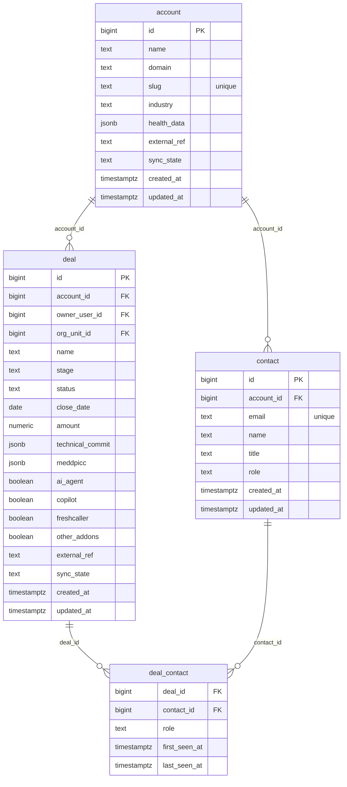

# Domain: Customer

Focused ER diagram for the **Customer** domain (4 tables). The composite join
table `deal_contact` links `deal` ↔ `contact` many-to-many.

**Tables:** `account`, `contact`, `deal`, `deal_contact`

## Internal relationships
- `contact` → `account` (account_id)
- `deal` → `account` (account_id)
- `deal_contact` → `deal` (deal_id)
- `deal_contact` → `contact` (contact_id)
- `deal` ↔ `contact` is many-to-many through `deal_contact`

## Cross-domain relationships
- `deal.owner_user_id` → `user` (Identity & Org)
- `deal.org_unit_id` → `org_unit` (Identity & Org)
- `deal` is referenced by: `activity.deal_id`, `pre_call.deal_id`,
  `post_call.deal_id`, `task.deal_id`, `product_signal.deal_id`
- `account` is referenced by: `activity.account_id`, `product_signal.account_id`
- `contact` is referenced by: `call_participant.contact_id`

## Notes
- `deal.owner_user_id` and `deal.org_unit_id` are FKs into the **Identity & Org**
  domain — they are not drawn in this diagram's edges to keep it scoped.
- `deal_contact` carries `first_seen_at` / `last_seen_at`, making it a temporal
  association (when did this contact first appear on the deal).
- `deal.meddpicc` and `deal.technical_commit` are JSONB blobs; the schema keeps them
  untyped at the column level and validates via app-layer contracts.