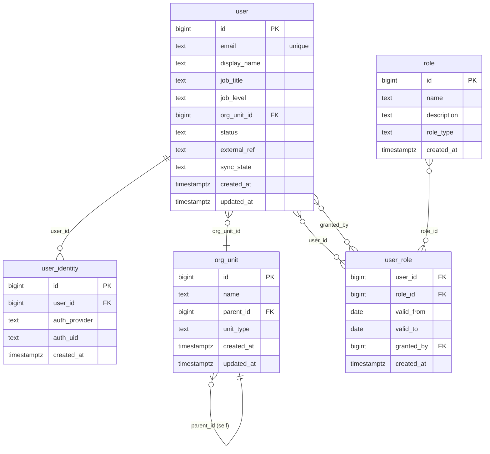

# Domain: Identity & Org

Focused ER diagram for the **Identity & Org** domain (5 tables). Internal
relationships are drawn explicitly; cross-domain references are listed as
comments so the diagram stays readable.

**Tables:** `user`, `user_identity`, `org_unit`, `role`, `user_role`

## Internal relationships
- `user_identity` → `user` (user_id)
- `user_role` → `user` (user_id)
- `user_role` → `role` (role_id)
- `user_role` → `user` (granted_by) — same target as user_id, different role
- `org_unit` → `org_unit` (parent_id) — self-referential hierarchy
- `user` → `org_unit` (org_unit_id)

## Cross-domain relationships
- `user` is referenced by: `deal.owner_user_id`, `activity.owner_user_id`,
  `task.owner_user_id`, `scorecard.owner_user_id`, `score_override.created_by`,
  `product_signal.owner_user_id`, `product_signal.reviewed_by`,
  `coaching_focus.se_user_id`, `coaching_focus.set_by_user_id`,
  `coaching_reflection.se_user_id`, `coaching_recommendation.se_user_id`,
  `audit_log.user_id`
- `org_unit` is referenced by: `deal.org_unit_id`, `activity.org_unit_id`

## Notes
- `user_role` is a pure join table (composite PK `user_id + role_id`); `granted_by`
  is a second FK back to `user` recording who assigned the role.
- `org_unit` is a recursive tree — `parent_id` references its own PK.
- `email` and `slug`-style unique constraints are the natural lookup keys for the
  identity/customer boundaries respectively; here `user.email` is unique.