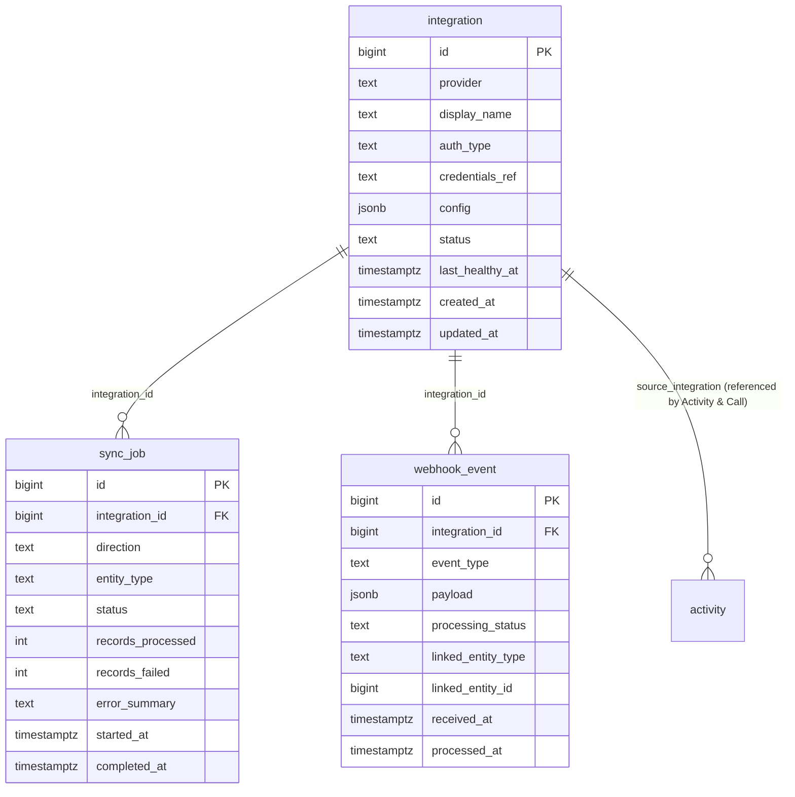

# Domain: Integration

Focused ER diagram for the **Integration** domain (3 tables). `integration` is the
catalog row (one per connected provider); `sync_job` and `webhook_event` are the
two operational children — pull vs push ingestion.

**Tables:** `integration`, `sync_job`, `webhook_event`

## Internal relationships
- `sync_job` → `integration` (integration_id)
- `webhook_event` → `integration` (integration_id)

## Cross-domain relationships
- `activity.source_integration` → `integration` (i.e. `integration` is referenced
  from the Activity & Call domain — the only inbound cross-domain FK)

## Notes
- `credentials_ref` is a pointer (e.g. a Secret Manager resource name), never the
  secret material itself — the model deliberately keeps credentials out of the row.
- `sync_job.direction` is `inbound | outbound`; `entity_type` names the synced
  resource (`deal`, `contact`, `activity`, …). `records_processed` /
  `records_failed` give a per-run health summary; `error_summary` is a short
  human-readable blob.
- `webhook_event` is the raw inbound envelope — `linked_entity_type` +
  `linked_entity_id` form a polymorphic link to whichever row the webhook ended
  up creating/updating. `processing_status` is `pending → processed | failed |
  dead_letter`.
- This domain has no outbound FKs into other tables — it is a leaf domain that
  other domains point **into** (only `activity.source_integration` does so today).