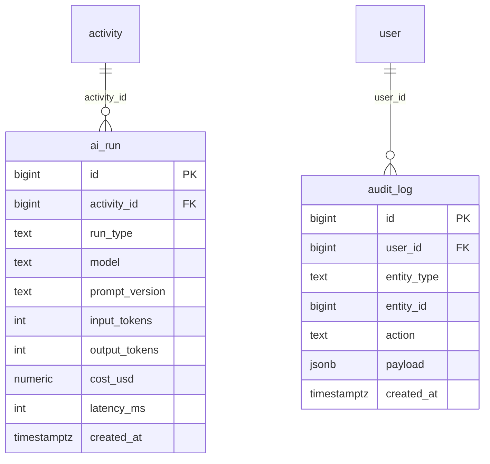

# Domain: Platform

Focused ER diagram for the **Platform** domain (2 tables). These are
cross-cutting operational tables — observability and audit — that sit on top of
the rest of the schema rather than modelling business entities.

**Tables:** `ai_run`, `audit_log`

## Internal relationships
- none (the two tables are independent)

## Cross-domain relationships
- `ai_run.activity_id` → `activity` (Activity & Call) — records which call an AI
  invocation was run against
- `audit_log.user_id` → `user` (Identity & Org) — who performed the audited action
- `audit_log` is otherwise polymorphic: `entity_type` + `entity_id` identify the
  target row in any table (no enforced FK)

## Notes
- `ai_run` is the cost/latency ledger for every LLM call: `run_type` distinguishes
  pre-call research, post-call analysis, scorecard generation, coaching
  synthesis, etc. `prompt_version` is critical for reproducibility — the same
  `model` + different `prompt_version` can produce materially different output.
- `audit_log` uses a polymorphic target (`entity_type` + `entity_id`) rather than
  one FK per table. This is deliberate: audit must cover every table, and a
  concrete FK per target would explode the column count and couple audit to the
  schema. The `user_id` FK is the only enforced one because every audited action
  has a known actor.
- Neither table is ever updated — both are append-only. `audit_log.payload` is
  JSONB so the before/after diff can be stored without a per-table shape.
- This is the only domain with zero internal edges; it is connected to the rest
  of the model purely through the two cross-domain FKs above.