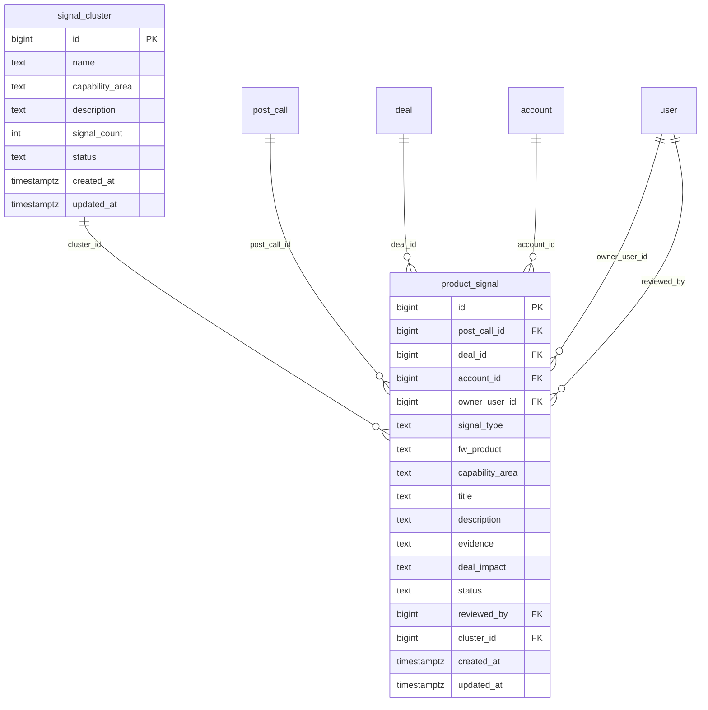

# Domain: Product Intelligence

Focused ER diagram for the **Product Intelligence** domain (2 tables). `signal_cluster`
is the catalog; `product_signal` is the per-call evidence that populates it.

**Tables:** `product_signal`, `signal_cluster`

## Internal relationships
- `product_signal` → `signal_cluster` (cluster_id, nullable — a signal may be
  un-clustered until reviewed)

## Cross-domain relationships
- `product_signal.post_call_id` → `post_call` (Activity & Call)
- `product_signal.deal_id` → `deal` (Customer)
- `product_signal.account_id` → `account` (Customer)
- `product_signal.owner_user_id` → `user` (Identity & Org)
- `product_signal.reviewed_by` → `user` (Identity & Org)

## Notes
- `product_signal` is the densest table in the model by FK count (six FKs): it
  joins back to the call that produced it, the deal and account it concerns, the
  owning SE, the reviewer, and the optional cluster it has been grouped into.
- `signal_cluster.signal_count` is a denormalised counter — maintained on insert
  / update of `product_signal.cluster_id` rather than computed live.
- `product_signal.status` models the review lifecycle (`pending → reviewed |
  dismissed`); `reviewed_by` is populated only when it leaves `pending`.
- Two FKs to `user` (`owner_user_id`, `reviewed_by`) mean the same `user` can
  appear in both roles — they are independent relationships, not the same edge.