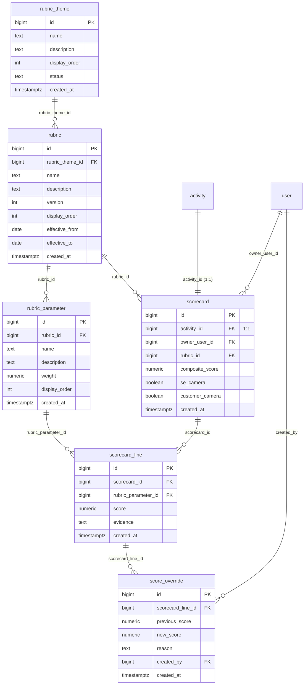

# Domain: Scoring

Focused ER diagram for the **Scoring** domain (6 tables). Two parallel trees share
the `rubric_theme` root: the rubric definition chain (`rubric_theme → rubric →
rubric_parameter`) and the scoring chain (`scorecard → scorecard_line →
score_override`). `scorecard` is 1:1 with `activity`.

**Tables:** `rubric_theme`, `rubric`, `rubric_parameter`, `scorecard`,
`scorecard_line`, `score_override`

## Internal relationships
- `rubric` → `rubric_theme` (rubric_theme_id)
- `rubric_parameter` → `rubric` (rubric_id)
- `scorecard_line` → `scorecard` (scorecard_id)
- `scorecard_line` → `rubric_parameter` (rubric_parameter_id)
- `score_override` → `scorecard_line` (scorecard_line_id)

## Cross-domain relationships
- `scorecard.activity_id` → `activity` (**1:1**)
- `scorecard.owner_user_id` → `user` (Identity & Org)
- `scorecard.rubric_id` → `rubric` (internal)
- `score_override.created_by` → `user` (Identity & Org)
- `rubric_theme` is referenced by: `coaching_focus.rubric_theme_id`,
  `coaching_recommendation.rubric_theme_id` (both Coaching domain)

## Notes
- A `scorecard` is created exactly once per `activity` (1:1, enforced by a unique
  constraint on `activity_id`). It is the persisted evaluation of one call against
  one `rubric`.
- Each `scorecard_line` is one row per `rubric_parameter` — the join of those two
  tables gives you the parameter name + weight alongside the score.
- `score_override` is an append-only audit trail: never updates `scorecard_line`
  in place; a new row records `previous_score → new_score` plus `reason` and the
  `created_by` user. This preserves the full history of human corrections.
- `rubric.effective_from / effective_to` allow versioned rubrics to coexist; a
  scorecard pins a specific `rubric_id` so historical scores stay comparable.