# Janus Data Model — High-Level ER Diagram

Complete schema: **30 tables · 8 domains · 52 foreign keys**. Rendered as a single
Mermaid `erDiagram` (GitHub native). For an interactive force-directed graph view
see [`data-model-graph.html`](./data-model-graph.html).

Legend for column annotations: `PK` primary key · `FK` foreign key · `"unique"`
a unique-constrained column (shown as a comment, since Mermaid's erDiagram
grammar only recognises `PK`/`FK` as key markers) · `JSONB` typed JSON column.
`// FK → target` notes resolve the referenced table when the column name alone is
ambiguous (e.g. `granted_by → user`, `reviewed_by → user`).

```mermaid
erDiagram
    %% ──────────── Identity & Org ────────────
    user {
        bigint id PK
        text email "unique"
        text display_name
        text job_title
        text job_level
        bigint org_unit_id FK
        text status
        text external_ref
        text sync_state
        timestamptz created_at
        timestamptz updated_at
    }
    user_identity {
        bigint id PK
        bigint user_id FK
        text auth_provider
        text auth_uid
        timestamptz created_at
    }
    org_unit {
        bigint id PK
        text name
        bigint parent_id FK
        text unit_type
        timestamptz created_at
        timestamptz updated_at
    }
    role {
        bigint id PK
        text name
        text description
        text role_type
        timestamptz created_at
    }
    user_role {
        bigint user_id FK
        bigint role_id FK
        date valid_from
        date valid_to
        bigint granted_by FK
        timestamptz created_at
    }

    %% ──────────── Customer ────────────
    account {
        bigint id PK
        text name
        text domain
        text slug "unique"
        text industry
        jsonb health_data
        text external_ref
        text sync_state
        timestamptz created_at
        timestamptz updated_at
    }
    contact {
        bigint id PK
        bigint account_id FK
        text email "unique"
        text name
        text title
        text role
        timestamptz created_at
        timestamptz updated_at
    }
    deal {
        bigint id PK
        bigint account_id FK
        bigint owner_user_id FK
        bigint org_unit_id FK
        text name
        text stage
        text status
        date close_date
        numeric amount
        jsonb technical_commit
        jsonb meddpicc
        boolean ai_agent
        boolean copilot
        boolean freshcaller
        boolean other_addons
        text external_ref
        text sync_state
        timestamptz created_at
        timestamptz updated_at
    }
    deal_contact {
        bigint deal_id FK
        bigint contact_id FK
        text role
        timestamptz first_seen_at
        timestamptz last_seen_at
    }

    %% ──────────── Activity & Call ────────────
    activity {
        bigint id PK
        bigint deal_id FK
        bigint account_id FK
        bigint owner_user_id FK
        bigint org_unit_id FK
        text activity_type
        text subject
        text description
        timestamptz occurred_at
        int duration_minutes
        bigint source_integration FK
        text external_ref
        text sync_state
        timestamptz created_at
        timestamptz updated_at
    }
    pre_call {
        bigint id PK
        bigint activity_id FK "1:1"
        bigint deal_id FK
        jsonb research_brief
        jsonb input_snapshot
        timestamptz generated_at
        timestamptz created_at
    }
    post_call {
        bigint id PK
        bigint activity_id FK "1:1"
        bigint deal_id FK
        text transcript_ref
        jsonb analysis
        jsonb detail
        timestamptz created_at
        timestamptz updated_at
    }
    call_participant {
        bigint id PK
        bigint activity_id FK
        bigint contact_id FK
        text participant_role
        timestamptz created_at
    }
    task {
        bigint id PK
        bigint activity_id FK
        bigint deal_id FK
        bigint owner_user_id FK
        text title
        text description
        text status
        date due_date
        text source
        timestamptz created_at
        timestamptz updated_at
    }

    %% ──────────── Scoring ────────────
    rubric_theme {
        bigint id PK
        text name
        text description
        int display_order
        text status
        timestamptz created_at
    }
    rubric {
        bigint id PK
        bigint rubric_theme_id FK
        text name
        text description
        int version
        int display_order
        date effective_from
        date effective_to
        timestamptz created_at
    }
    rubric_parameter {
        bigint id PK
        bigint rubric_id FK
        text name
        text description
        numeric weight
        int display_order
        timestamptz created_at
    }
    scorecard {
        bigint id PK
        bigint activity_id FK "1:1"
        bigint owner_user_id FK
        bigint rubric_id FK
        numeric composite_score
        boolean se_camera
        boolean customer_camera
        timestamptz created_at
    }
    scorecard_line {
        bigint id PK
        bigint scorecard_id FK
        bigint rubric_parameter_id FK
        numeric score
        text evidence
        timestamptz created_at
    }
    score_override {
        bigint id PK
        bigint scorecard_line_id FK
        numeric previous_score
        numeric new_score
        text reason
        bigint created_by FK
        timestamptz created_at
    }

    %% ──────────── Product Intelligence ────────────
    product_signal {
        bigint id PK
        bigint post_call_id FK
        bigint deal_id FK
        bigint account_id FK
        bigint owner_user_id FK
        text signal_type
        text fw_product
        text capability_area
        text title
        text description
        text evidence
        text deal_impact
        text status
        bigint reviewed_by FK
        bigint cluster_id FK
        timestamptz created_at
        timestamptz updated_at
    }
    signal_cluster {
        bigint id PK
        text name
        text capability_area
        text description
        int signal_count
        text status
        timestamptz created_at
        timestamptz updated_at
    }

    %% ──────────── Coaching ────────────
    coaching_focus {
        bigint id PK
        bigint se_user_id FK
        bigint set_by_user_id FK
        bigint rubric_theme_id FK
        text description
        text target
        text status
        date timeframe_start
        date timeframe_end
        timestamptz created_at
        timestamptz updated_at
    }
    coaching_reflection {
        bigint id PK
        bigint se_user_id FK
        bigint coaching_focus_id FK
        bigint activity_id FK
        text reflection_text
        timestamptz created_at
    }
    coaching_recommendation {
        bigint id PK
        bigint se_user_id FK
        bigint rubric_theme_id FK
        text recommendation_text
        text evidence_summary
        text status
        timestamptz generated_at
        timestamptz dismissed_at
    }

    %% ──────────── Integration ────────────
    integration {
        bigint id PK
        text provider
        text display_name
        text auth_type
        text credentials_ref
        jsonb config
        text status
        timestamptz last_healthy_at
        timestamptz created_at
        timestamptz updated_at
    }
    sync_job {
        bigint id PK
        bigint integration_id FK
        text direction
        text entity_type
        text status
        int records_processed
        int records_failed
        text error_summary
        timestamptz started_at
        timestamptz completed_at
    }
    webhook_event {
        bigint id PK
        bigint integration_id FK
        text event_type
        jsonb payload
        text processing_status
        text linked_entity_type
        bigint linked_entity_id
        timestamptz received_at
        timestamptz processed_at
    }

    %% ──────────── Platform ────────────
    ai_run {
        bigint id PK
        bigint activity_id FK
        text run_type
        text model
        text prompt_version
        int input_tokens
        int output_tokens
        numeric cost_usd
        int latency_ms
        timestamptz created_at
    }
    audit_log {
        bigint id PK
        bigint user_id FK
        text entity_type
        bigint entity_id
        text action
        jsonb payload
        timestamptz created_at
    }

    %% ──────────── Relationships (FK edges) ────────────
    %% Identity & Org
    user ||--o{ user_identity : "has identity"
    user }o--|| org_unit : "belongs to"
    org_unit }o--|| org_unit : "parent of"
    user }o--o{ user_role : "user_id"
    user }o--o{ user_role : "granted_by"
    role }o--o{ user_role : "assigned"

    %% Customer
    account ||--o{ contact : "has"
    account ||--o{ deal : "owns"
    user ||--o{ deal : "owner_user_id"
    org_unit ||--o{ deal : "scoped to"
    deal }o--o{ contact : "deal_contact"
    deal ||--o{ deal_contact : "deal_id"
    contact ||--o{ deal_contact : "contact_id"

    %% Activity & Call
    activity }o--|| deal : "deal_id"
    activity }o--|| account : "account_id"
    activity }o--|| user : "owner_user_id"
    activity }o--|| org_unit : "org_unit_id"
    activity }o--|| integration : "source_integration"
    activity ||--|| pre_call : "activity_id 1:1"
    activity ||--|| post_call : "activity_id 1:1"
    activity ||--o{ call_participant : "activity_id"
    activity ||--o{ task : "activity_id"
    pre_call }o--|| deal : "deal_id"
    post_call }o--|| deal : "deal_id"
    contact ||--o{ call_participant : "contact_id"
    task }o--|| deal : "deal_id"
    task }o--|| user : "owner_user_id"

    %% Scoring
    rubric_theme ||--o{ rubric : "contains"
    rubric ||--o{ rubric_parameter : "has"
    activity ||--|| scorecard : "activity_id 1:1"
    user ||--o{ scorecard : "owner_user_id"
    rubric ||--o{ scorecard : "scored by"
    scorecard ||--o{ scorecard_line : "scorecard_id"
    rubric_parameter ||--o{ scorecard_line : "rubric_parameter_id"
    scorecard_line ||--o{ score_override : "scorecard_line_id"
    user ||--o{ score_override : "created_by"

    %% Product Intelligence
    post_call ||--o{ product_signal : "post_call_id"
    deal ||--o{ product_signal : "deal_id"
    account ||--o{ product_signal : "account_id"
    user ||--o{ product_signal : "owner_user_id"
    user ||--o{ product_signal : "reviewed_by"
    signal_cluster ||--o{ product_signal : "cluster_id"

    %% Coaching
    user ||--o{ coaching_focus : "se_user_id"
    user ||--o{ coaching_focus : "set_by_user_id"
    rubric_theme ||--o{ coaching_focus : "rubric_theme_id"
    user ||--o{ coaching_reflection : "se_user_id"
    coaching_focus ||--o{ coaching_reflection : "coaching_focus_id"
    activity ||--o{ coaching_reflection : "activity_id"
    user ||--o{ coaching_recommendation : "se_user_id"
    rubric_theme ||--o{ coaching_recommendation : "rubric_theme_id"

    %% Integration
    integration ||--o{ sync_job : "integration_id"
    integration ||--o{ webhook_event : "integration_id"

    %% Platform
    activity ||--o{ ai_run : "activity_id"
    user ||--o{ audit_log : "user_id"
```

## Domain index

| Domain | Tables |
|---|---|
| Identity & Org | `user`, `user_identity`, `org_unit`, `role`, `user_role` |
| Customer | `account`, `contact`, `deal`, `deal_contact` |
| Activity & Call | `activity`, `pre_call`, `post_call`, `call_participant`, `task` |
| Scoring | `rubric_theme`, `rubric`, `rubric_parameter`, `scorecard`, `scorecard_line`, `score_override` |
| Product Intelligence | `product_signal`, `signal_cluster` |
| Coaching | `coaching_focus`, `coaching_reflection`, `coaching_recommendation` |
| Integration | `integration`, `sync_job`, `webhook_event` |
| Platform | `ai_run`, `audit_log` |

See the per-domain focused diagrams for columns and both internal + cross-domain
relationships: [`domain-identity-org.md`](./domain-identity-org.md),
[`domain-customer.md`](./domain-customer.md),
[`domain-activity-call.md`](./domain-activity-call.md),
[`domain-scoring.md`](./domain-scoring.md),
[`domain-product-intelligence.md`](./domain-product-intelligence.md),
[`domain-coaching.md`](./domain-coaching.md),
[`domain-integration.md`](./domain-integration.md),
[`domain-platform.md`](./domain-platform.md).