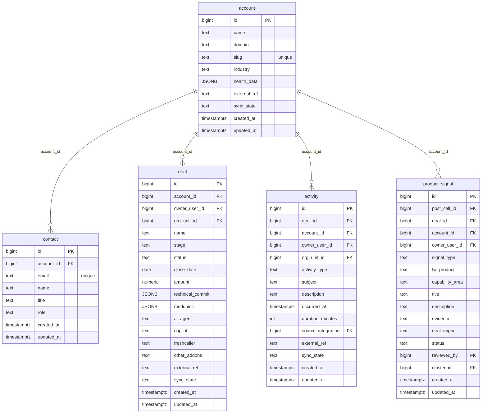

# `table-account.md` — account  (domain: Customer)

Focused local-context view of the **account** table and its immediate FK neighbors.

## Mini ER diagram

## Relationships

**Inbound (source → this table via column):**
- `contact.account_id` → `account.id` (1:N)
- `deal.account_id` → `account.id` (1:N)
- `activity.account_id` → `account.id` (1:N)
- `product_signal.account_id` → `account.id` (1:N)

## Notes

A customer account. Deduped by slug. Holds ChurnZero health_data.
