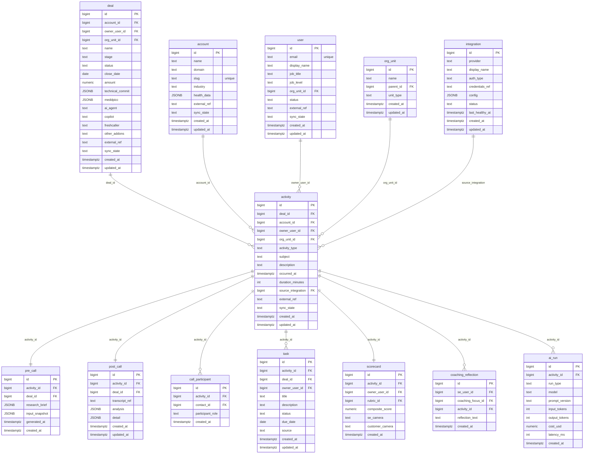

# `table-activity.md` — activity  (domain: Activity & Call)

Focused local-context view of the **activity** table and its immediate FK neighbors.

## Mini ER diagram

## Relationships

**Outbound (this table → target via column):**
- `activity.deal_id` → `deal.id` (N:1)
- `activity.account_id` → `account.id` (N:1)
- `activity.owner_user_id` → `user.id` (N:1)
- `activity.org_unit_id` → `org_unit.id` (N:1)
- `activity.source_integration` → `integration.id` (N:1)

**Inbound (source → this table via column):**
- `pre_call.activity_id` → `activity.id` (1:1)
- `post_call.activity_id` → `activity.id` (1:1)
- `call_participant.activity_id` → `activity.id` (1:N)
- `task.activity_id` → `activity.id` (1:N)
- `scorecard.activity_id` → `activity.id` (1:1)
- `coaching_reflection.activity_id` → `activity.id` (1:N)
- `ai_run.activity_id` → `activity.id` (1:N)

## Notes

The spine — every SE action is a row. Call-type gets pre/post 1:1.
