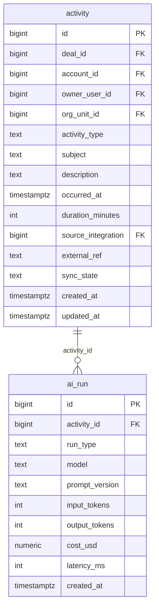

# `table-ai_run.md` — ai_run  (domain: Platform)

Focused local-context view of the **ai_run** table and its immediate FK neighbors.

## Mini ER diagram

## Relationships

**Outbound (this table → target via column):**
- `ai_run.activity_id` → `activity.id` (N:1)

## Notes

An AI pipeline run with cost/latency tracking.
