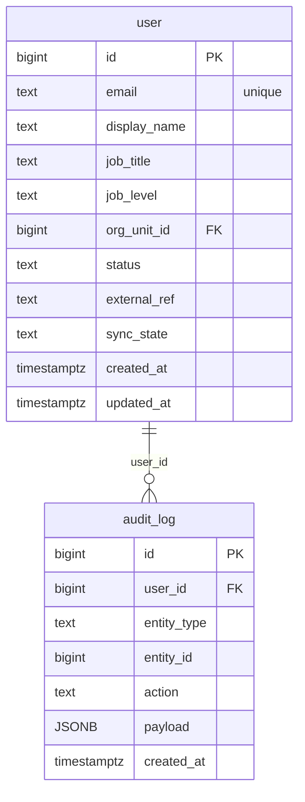

# `table-audit_log.md` — audit_log  (domain: Platform)

Focused local-context view of the **audit_log** table and its immediate FK neighbors.

## Mini ER diagram

## Relationships

**Outbound (this table → target via column):**
- `audit_log.user_id` → `user.id` (N:1)

## Notes

Append-only audit of all actions.
