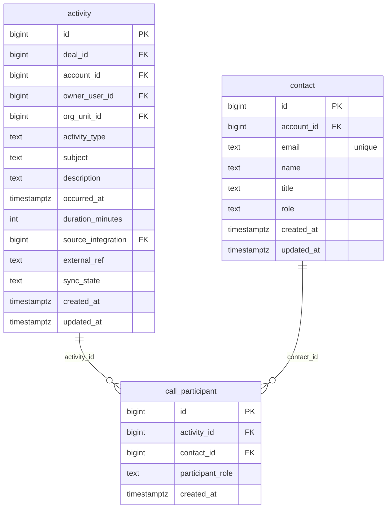

# `table-call_participant.md` — call_participant  (domain: Activity & Call)

Focused local-context view of the **call_participant** table and its immediate FK neighbors.

## Mini ER diagram

## Relationships

**Outbound (this table → target via column):**
- `call_participant.activity_id` → `activity.id` (N:1)
- `call_participant.contact_id` → `contact.id` (N:1)

## Notes

Who attended a call.
