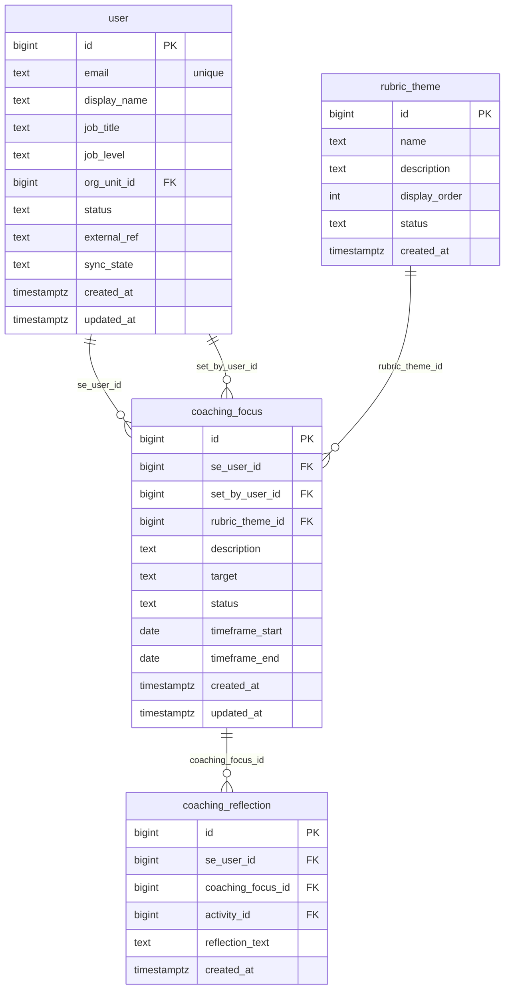

# `table-coaching_focus.md` — coaching_focus  (domain: Coaching)

Focused local-context view of the **coaching_focus** table and its immediate FK neighbors.

## Mini ER diagram

## Relationships

**Outbound (this table → target via column):**
- `coaching_focus.se_user_id` → `user.id` (N:1)
- `coaching_focus.set_by_user_id` → `user.id` (N:1)
- `coaching_focus.rubric_theme_id` → `rubric_theme.id` (N:1)

**Inbound (source → this table via column):**
- `coaching_reflection.coaching_focus_id` → `coaching_focus.id` (1:N)

## Notes

Manager-set focus area for an SE.
