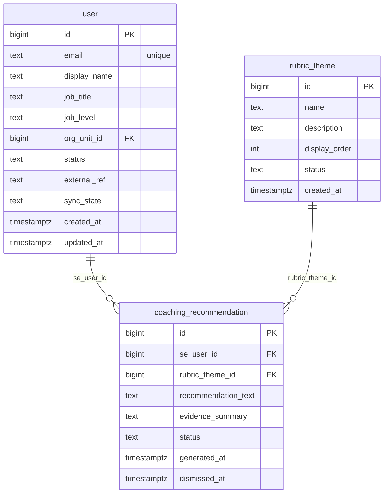

# `table-coaching_recommendation.md` — coaching_recommendation  (domain: Coaching)

Focused local-context view of the **coaching_recommendation** table and its immediate FK neighbors.

## Mini ER diagram

## Relationships

**Outbound (this table → target via column):**
- `coaching_recommendation.se_user_id` → `user.id` (N:1)
- `coaching_recommendation.rubric_theme_id` → `rubric_theme.id` (N:1)

## Notes

System-generated coaching recommendation.
