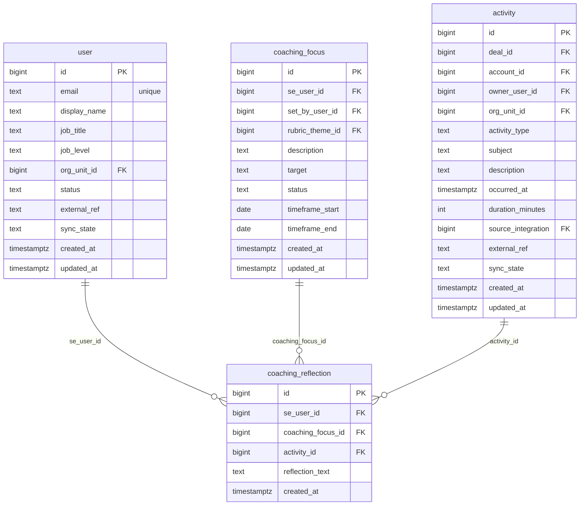

# `table-coaching_reflection.md` — coaching_reflection  (domain: Coaching)

Focused local-context view of the **coaching_reflection** table and its immediate FK neighbors.

## Mini ER diagram

## Relationships

**Outbound (this table → target via column):**
- `coaching_reflection.se_user_id` → `user.id` (N:1)
- `coaching_reflection.coaching_focus_id` → `coaching_focus.id` (N:1)
- `coaching_reflection.activity_id` → `activity.id` (N:1)

## Notes

SE's private self-reflection.
