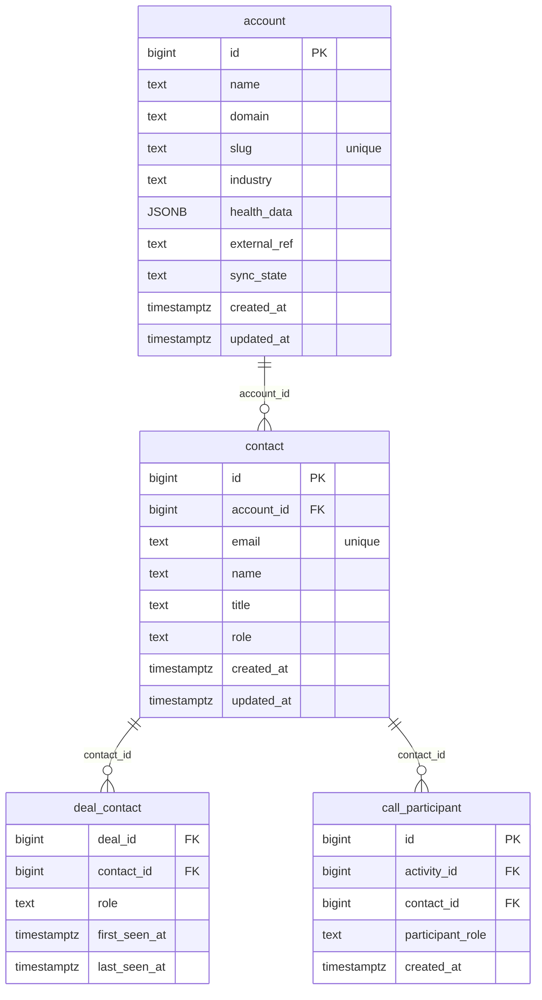

# `table-contact.md` — contact  (domain: Customer)

Focused local-context view of the **contact** table and its immediate FK neighbors.

## Mini ER diagram

## Relationships

**Outbound (this table → target via column):**
- `contact.account_id` → `account.id` (N:1)

**Inbound (source → this table via column):**
- `deal_contact.contact_id` → `contact.id` (1:N)
- `call_participant.contact_id` → `contact.id` (1:N)

## Notes

A person at an account. Email unique per account.
