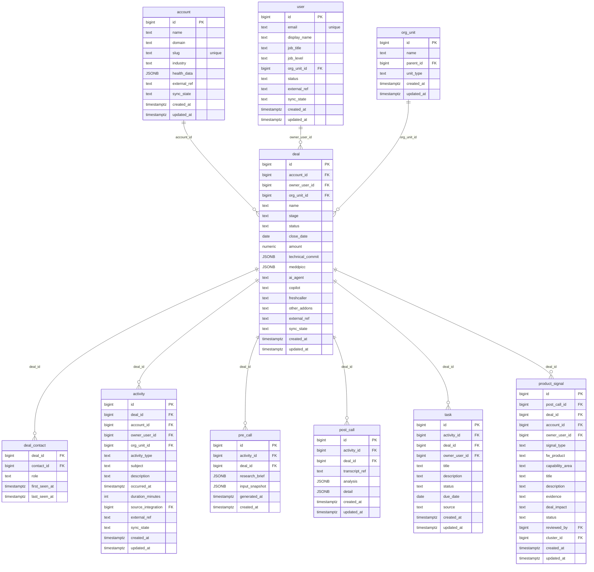

# `table-deal.md` — deal  (domain: Customer)

Focused local-context view of the **deal** table and its immediate FK neighbors.

## Mini ER diagram

## Relationships

**Outbound (this table → target via column):**
- `deal.account_id` → `account.id` (N:1)
- `deal.owner_user_id` → `user.id` (N:1)
- `deal.org_unit_id` → `org_unit.id` (N:1)

**Inbound (source → this table via column):**
- `deal_contact.deal_id` → `deal.id` (1:N)
- `activity.deal_id` → `deal.id` (1:N)
- `pre_call.deal_id` → `deal.id` (1:N)
- `post_call.deal_id` → `deal.id` (1:N)
- `task.deal_id` → `deal.id` (1:N)
- `product_signal.deal_id` → `deal.id` (1:N)

## Notes

A sales opportunity. Holds TC + MEDDPICC JSONB, add-ons.
