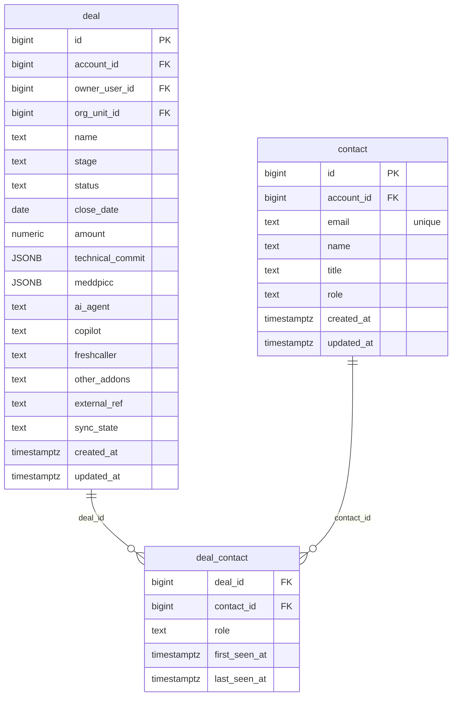

# `table-deal_contact.md` — deal_contact  (domain: Customer)

Focused local-context view of the **deal_contact** table and its immediate FK neighbors.

## Mini ER diagram

## Relationships

**Outbound (this table → target via column):**
- `deal_contact.deal_id` → `deal.id` (N:1)
- `deal_contact.contact_id` → `contact.id` (N:1)

## Notes

Junction tracking a contact's role on a deal across calls.
