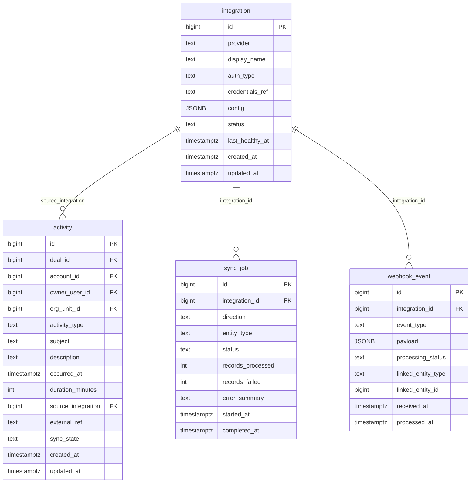

# `table-integration.md` — integration  (domain: Integration)

Focused local-context view of the **integration** table and its immediate FK neighbors.

## Mini ER diagram

## Relationships

**Inbound (source → this table via column):**
- `activity.source_integration` → `integration.id` (1:N)
- `sync_job.integration_id` → `integration.id` (1:N)
- `webhook_event.integration_id` → `integration.id` (1:N)

## Notes

A connected external system (zoom/kaia/salesforce/churnzero).
