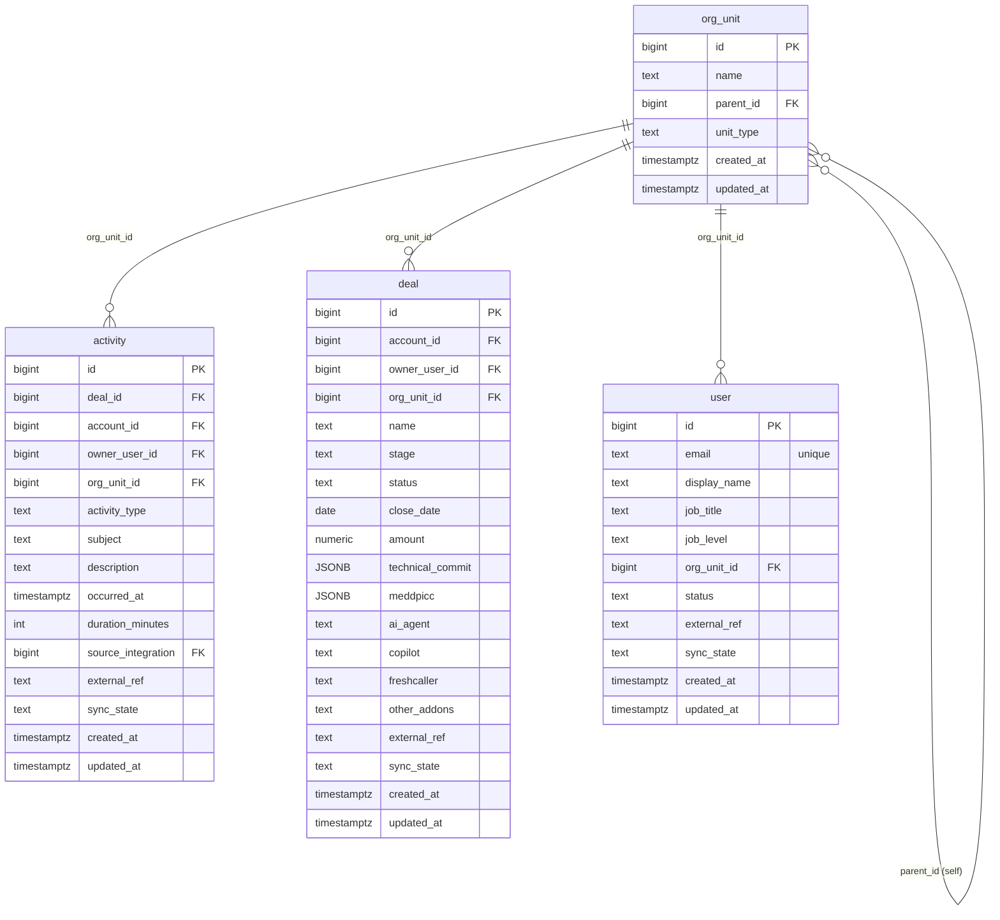

# `table-org_unit.md` — org_unit  (domain: Identity & Org)

Focused local-context view of the **org_unit** table and its immediate FK neighbors.

## Mini ER diagram

## Relationships

**Outbound (this table → target via column):**
- `org_unit.parent_id` → `org_unit.id` (self-ref)

**Inbound (source → this table via column):**
- `user.org_unit_id` → `org_unit.id` (1:N)
- `deal.org_unit_id` → `org_unit.id` (1:N)
- `activity.org_unit_id` → `org_unit.id` (1:N)

## Notes

Self-referencing org tree (org/region/team/squad).
