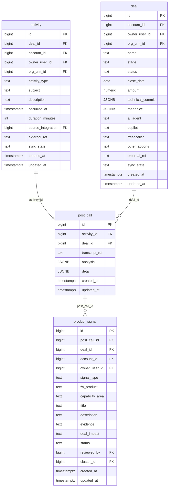

# `table-post_call.md` — post_call  (domain: Activity & Call)

Focused local-context view of the **post_call** table and its immediate FK neighbors.

## Mini ER diagram

## Relationships

**Outbound (this table → target via column):**
- `post_call.activity_id` → `activity.id` (1:1)
- `post_call.deal_id` → `deal.id` (N:1)

**Inbound (source → this table via column):**
- `product_signal.post_call_id` → `post_call.id` (1:N)

## Notes

1:1 satellite for post-call analysis + detail JSONB.
