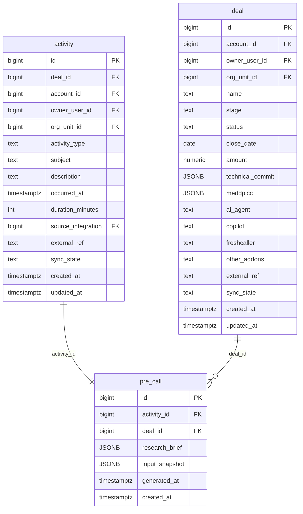

# `table-pre_call.md` — pre_call  (domain: Activity & Call)

Focused local-context view of the **pre_call** table and its immediate FK neighbors.

## Mini ER diagram

## Relationships

**Outbound (this table → target via column):**
- `pre_call.activity_id` → `activity.id` (1:1)
- `pre_call.deal_id` → `deal.id` (N:1)

## Notes

1:1 satellite for pre-call research brief.
