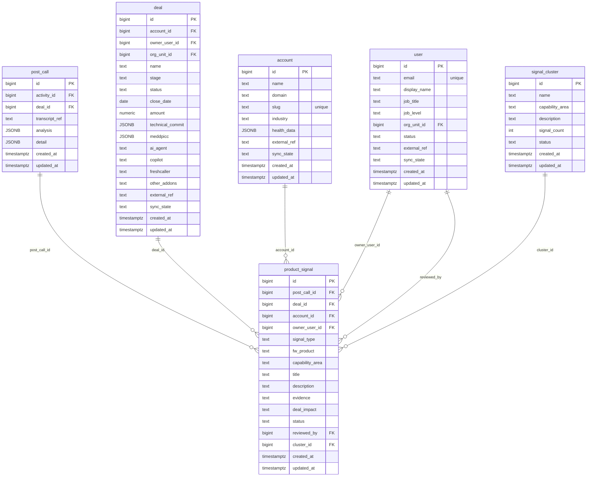

# `table-product_signal.md` — product_signal  (domain: Product Intelligence)

Focused local-context view of the **product_signal** table and its immediate FK neighbors.

## Mini ER diagram

## Relationships

**Outbound (this table → target via column):**
- `product_signal.post_call_id` → `post_call.id` (N:1)
- `product_signal.deal_id` → `deal.id` (N:1)
- `product_signal.account_id` → `account.id` (N:1)
- `product_signal.owner_user_id` → `user.id` (N:1)
- `product_signal.reviewed_by` → `user.id` (N:1)
- `product_signal.cluster_id` → `signal_cluster.id` (N:1)

## Notes

AI-extracted product signal for PM triage (8 types).
