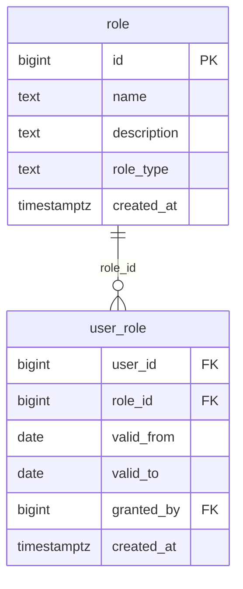

# `table-role.md` — role  (domain: Identity & Org)

Focused local-context view of the **role** table and its immediate FK neighbors.

## Mini ER diagram

## Relationships

**Inbound (source → this table via column):**
- `user_role.role_id` → `role.id` (1:N)

## Notes

A permission or job-function role.
