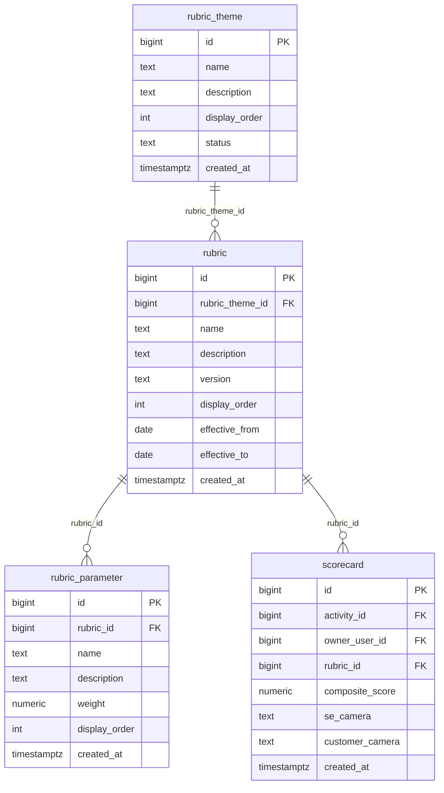

# `table-rubric.md` — rubric  (domain: Scoring)

Focused local-context view of the **rubric** table and its immediate FK neighbors.

## Mini ER diagram

## Relationships

**Outbound (this table → target via column):**
- `rubric.rubric_theme_id` → `rubric_theme.id` (N:1)

**Inbound (source → this table via column):**
- `rubric_parameter.rubric_id` → `rubric.id` (1:N)
- `scorecard.rubric_id` → `rubric.id` (1:N)

## Notes

A versioned rubric under a theme.
