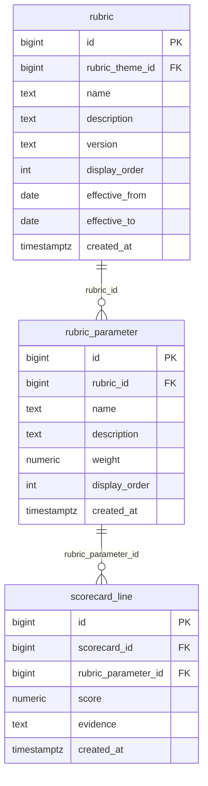

# `table-rubric_parameter.md` — rubric_parameter  (domain: Scoring)

Focused local-context view of the **rubric_parameter** table and its immediate FK neighbors.

## Mini ER diagram

## Relationships

**Outbound (this table → target via column):**
- `rubric_parameter.rubric_id` → `rubric.id` (N:1)

**Inbound (source → this table via column):**
- `scorecard_line.rubric_parameter_id` → `rubric_parameter.id` (1:N)

## Notes

A scored evaluation statement under a rubric (75 total).
