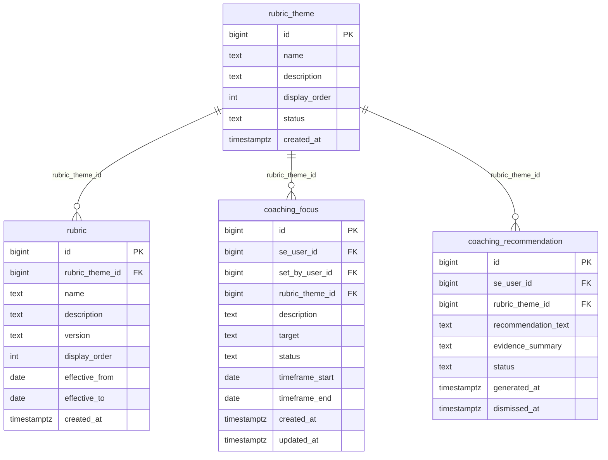

# `table-rubric_theme.md` — rubric_theme  (domain: Scoring)

Focused local-context view of the **rubric_theme** table and its immediate FK neighbors.

## Mini ER diagram

## Relationships

**Inbound (source → this table via column):**
- `rubric.rubric_theme_id` → `rubric_theme.id` (1:N)
- `coaching_focus.rubric_theme_id` → `rubric_theme.id` (1:N)
- `coaching_recommendation.rubric_theme_id` → `rubric_theme.id` (1:N)

## Notes

Top level of scoring (5 themes).
