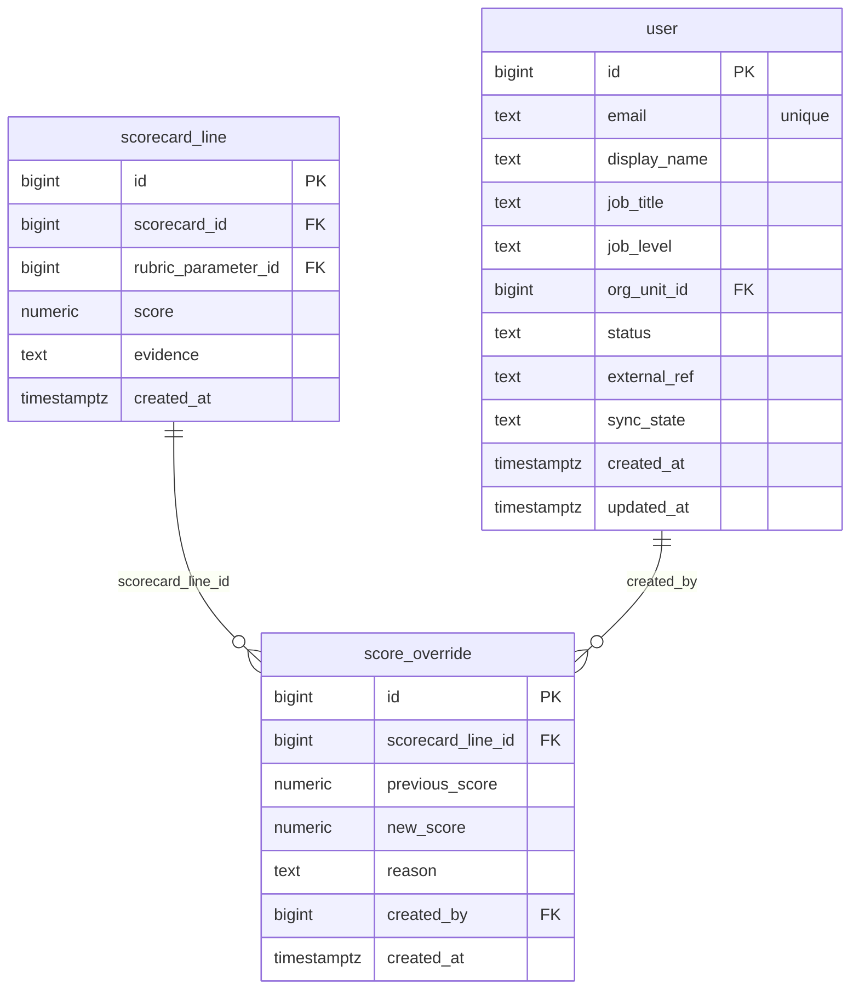

# `table-score_override.md` — score_override  (domain: Scoring)

Focused local-context view of the **score_override** table and its immediate FK neighbors.

## Mini ER diagram

## Relationships

**Outbound (this table → target via column):**
- `score_override.scorecard_line_id` → `scorecard_line.id` (N:1)
- `score_override.created_by` → `user.id` (N:1)

## Notes

Append-only dispute of a scorecard_line score.
