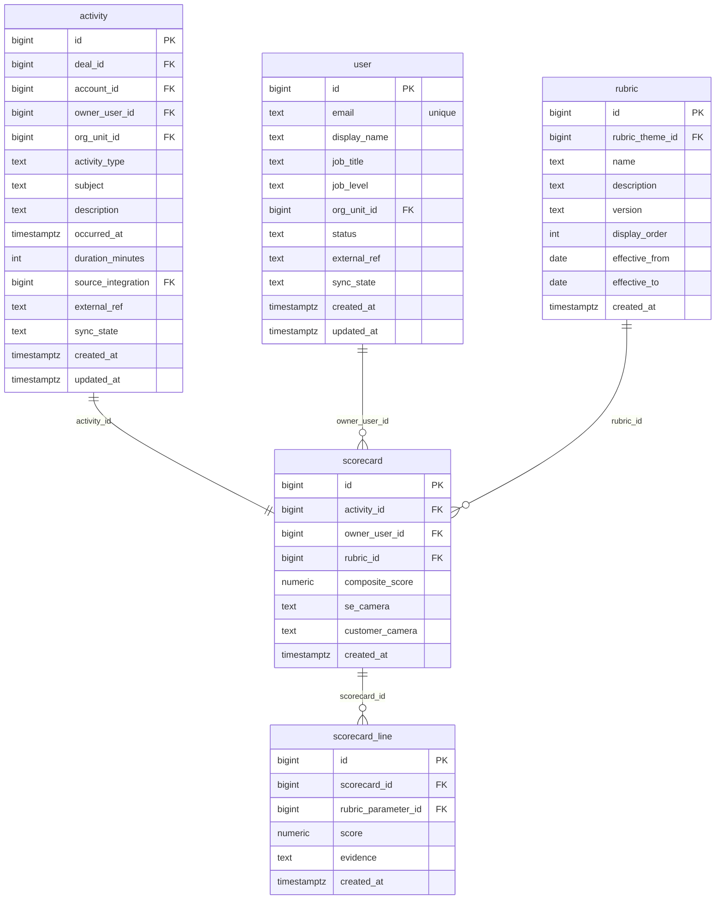

# `table-scorecard.md` — scorecard  (domain: Scoring)

Focused local-context view of the **scorecard** table and its immediate FK neighbors.

## Mini ER diagram

## Relationships

**Outbound (this table → target via column):**
- `scorecard.activity_id` → `activity.id` (1:1)
- `scorecard.owner_user_id` → `user.id` (N:1)
- `scorecard.rubric_id` → `rubric.id` (N:1)

**Inbound (source → this table via column):**
- `scorecard_line.scorecard_id` → `scorecard.id` (1:N)

## Notes

A scored call, pins the rubric version.
