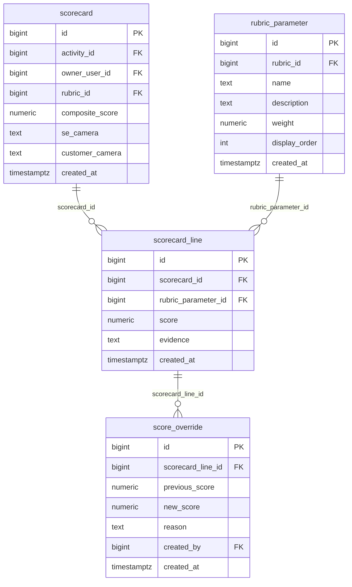

# `table-scorecard_line.md` — scorecard_line  (domain: Scoring)

Focused local-context view of the **scorecard_line** table and its immediate FK neighbors.

## Mini ER diagram

## Relationships

**Outbound (this table → target via column):**
- `scorecard_line.scorecard_id` → `scorecard.id` (N:1)
- `scorecard_line.rubric_parameter_id` → `rubric_parameter.id` (N:1)

**Inbound (source → this table via column):**
- `score_override.scorecard_line_id` → `scorecard_line.id` (1:N)

## Notes

One parameter's score on a scorecard (75 per call).
