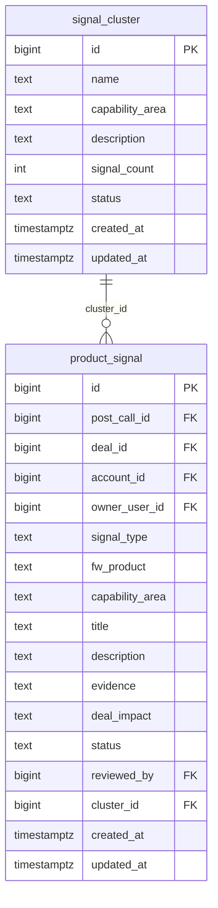

# `table-signal_cluster.md` — signal_cluster  (domain: Product Intelligence)

Focused local-context view of the **signal_cluster** table and its immediate FK neighbors.

## Mini ER diagram

## Relationships

**Inbound (source → this table via column):**
- `product_signal.cluster_id` → `signal_cluster.id` (1:N)

## Notes

Groups related product signals.
