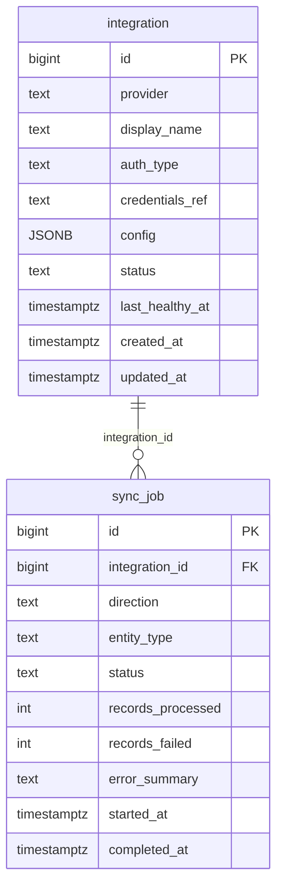

# `table-sync_job.md` — sync_job  (domain: Integration)

Focused local-context view of the **sync_job** table and its immediate FK neighbors.

## Mini ER diagram

## Relationships

**Outbound (this table → target via column):**
- `sync_job.integration_id` → `integration.id` (N:1)

## Notes

A sync run record for an integration.
