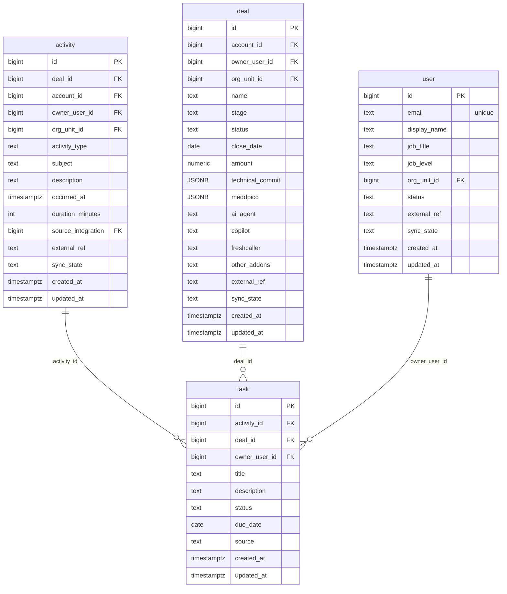

# `table-task.md` — task  (domain: Activity & Call)

Focused local-context view of the **task** table and its immediate FK neighbors.

## Mini ER diagram

## Relationships

**Outbound (this table → target via column):**
- `task.activity_id` → `activity.id` (N:1)
- `task.deal_id` → `deal.id` (N:1)
- `task.owner_user_id` → `user.id` (N:1)

## Notes

A follow-up task (AI-generated or manual).
