# `table-user.md` — user  (domain: Identity & Org)

Focused local-context view of the **user** table and its immediate FK neighbors.

## Mini ER diagram

```mermaid
erDiagram
    user {
        bigint id PK
        text email "unique"
        text display_name
        text job_title
        text job_level
        bigint org_unit_id FK
        text status
        text external_ref
        text sync_state
        timestamptz created_at
        timestamptz updated_at
    }
    activity {
        bigint id PK
        bigint deal_id FK
        bigint account_id FK
        bigint owner_user_id FK
        bigint org_unit_id FK
        text activity_type
        text subject
        text description
        timestamptz occurred_at
        int duration_minutes
        bigint source_integration FK
        text external_ref
        text sync_state
        timestamptz created_at
        timestamptz updated_at
    }
    audit_log {
        bigint id PK
        bigint user_id FK
        text entity_type
        bigint entity_id
        text action
        JSONB payload
        timestamptz created_at
    }
    coaching_focus {
        bigint id PK
        bigint se_user_id FK
        bigint set_by_user_id FK
        bigint rubric_theme_id FK
        text description
        text target
        text status
        date timeframe_start
        date timeframe_end
        timestamptz created_at
        timestamptz updated_at
    }
    coaching_recommendation {
        bigint id PK
        bigint se_user_id FK
        bigint rubric_theme_id FK
        text recommendation_text
        text evidence_summary
        text status
        timestamptz generated_at
        timestamptz dismissed_at
    }
    coaching_reflection {
        bigint id PK
        bigint se_user_id FK
        bigint coaching_focus_id FK
        bigint activity_id FK
        text reflection_text
        timestamptz created_at
    }
    deal {
        bigint id PK
        bigint account_id FK
        bigint owner_user_id FK
        bigint org_unit_id FK
        text name
        text stage
        text status
        date close_date
        numeric amount
        JSONB technical_commit
        JSONB meddpicc
        text ai_agent
        text copilot
        text freshcaller
        text other_addons
        text external_ref
        text sync_state
        timestamptz created_at
        timestamptz updated_at
    }
    org_unit {
        bigint id PK
        text name
        bigint parent_id FK
        text unit_type
        timestamptz created_at
        timestamptz updated_at
    }
    product_signal {
        bigint id PK
        bigint post_call_id FK
        bigint deal_id FK
        bigint account_id FK
        bigint owner_user_id FK
        text signal_type
        text fw_product
        text capability_area
        text title
        text description
        text evidence
        text deal_impact
        text status
        bigint reviewed_by FK
        bigint cluster_id FK
        timestamptz created_at
        timestamptz updated_at
    }
    score_override {
        bigint id PK
        bigint scorecard_line_id FK
        numeric previous_score
        numeric new_score
        text reason
        bigint created_by FK
        timestamptz created_at
    }
    scorecard {
        bigint id PK
        bigint activity_id FK
        bigint owner_user_id FK
        bigint rubric_id FK
        numeric composite_score
        text se_camera
        text customer_camera
        timestamptz created_at
    }
    task {
        bigint id PK
        bigint activity_id FK
        bigint deal_id FK
        bigint owner_user_id FK
        text title
        text description
        text status
        date due_date
        text source
        timestamptz created_at
        timestamptz updated_at
    }
    user_identity {
        bigint id PK
        bigint user_id FK
        text auth_provider
        text auth_uid
        timestamptz created_at
    }
    user_role {
        bigint user_id FK
        bigint role_id FK
        date valid_from
        date valid_to
        bigint granted_by FK
        timestamptz created_at
    }

    org_unit ||--o{ user : "org_unit_id"
    user ||--o{ user_identity : "user_id"
    user ||--o{ user_role : "user_id"
    user ||--o{ user_role : "granted_by"
    user ||--o{ deal : "owner_user_id"
    user ||--o{ activity : "owner_user_id"
    user ||--o{ task : "owner_user_id"
    user ||--o{ scorecard : "owner_user_id"
    user ||--o{ score_override : "created_by"
    user ||--o{ product_signal : "owner_user_id"
    user ||--o{ product_signal : "reviewed_by"
    user ||--o{ coaching_focus : "se_user_id"
    user ||--o{ coaching_focus : "set_by_user_id"
    user ||--o{ coaching_reflection : "se_user_id"
    user ||--o{ coaching_recommendation : "se_user_id"
    user ||--o{ audit_log : "user_id"
```

## Relationships

**Outbound (this table → target via column):**
- `user.org_unit_id` → `org_unit.id` (N:1)

**Inbound (source → this table via column):**
- `user_identity.user_id` → `user.id` (1:N)
- `user_role.user_id` → `user.id` (1:N)
- `user_role.granted_by` → `user.id` (1:N)
- `deal.owner_user_id` → `user.id` (1:N)
- `activity.owner_user_id` → `user.id` (1:N)
- `task.owner_user_id` → `user.id` (1:N)
- `scorecard.owner_user_id` → `user.id` (1:N)
- `score_override.created_by` → `user.id` (1:N)
- `product_signal.owner_user_id` → `user.id` (1:N)
- `product_signal.reviewed_by` → `user.id` (1:N)
- `coaching_focus.se_user_id` → `user.id` (1:N)
- `coaching_focus.set_by_user_id` → `user.id` (1:N)
- `coaching_reflection.se_user_id` → `user.id` (1:N)
- `coaching_recommendation.se_user_id` → `user.id` (1:N)
- `audit_log.user_id` → `user.id` (1:N)

## Notes

A Janus user (SE, manager, PM, admin, CSM, sales rep). Belongs to one org_unit.
