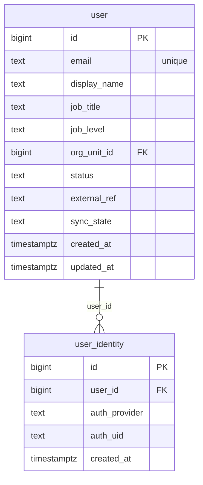

# `table-user_identity.md` — user_identity  (domain: Identity & Org)

Focused local-context view of the **user_identity** table and its immediate FK neighbors.

## Mini ER diagram

## Relationships

**Outbound (this table → target via column):**
- `user_identity.user_id` → `user.id` (N:1)

## Notes

Auth provider binding (firebase/google_sso) for a user.
