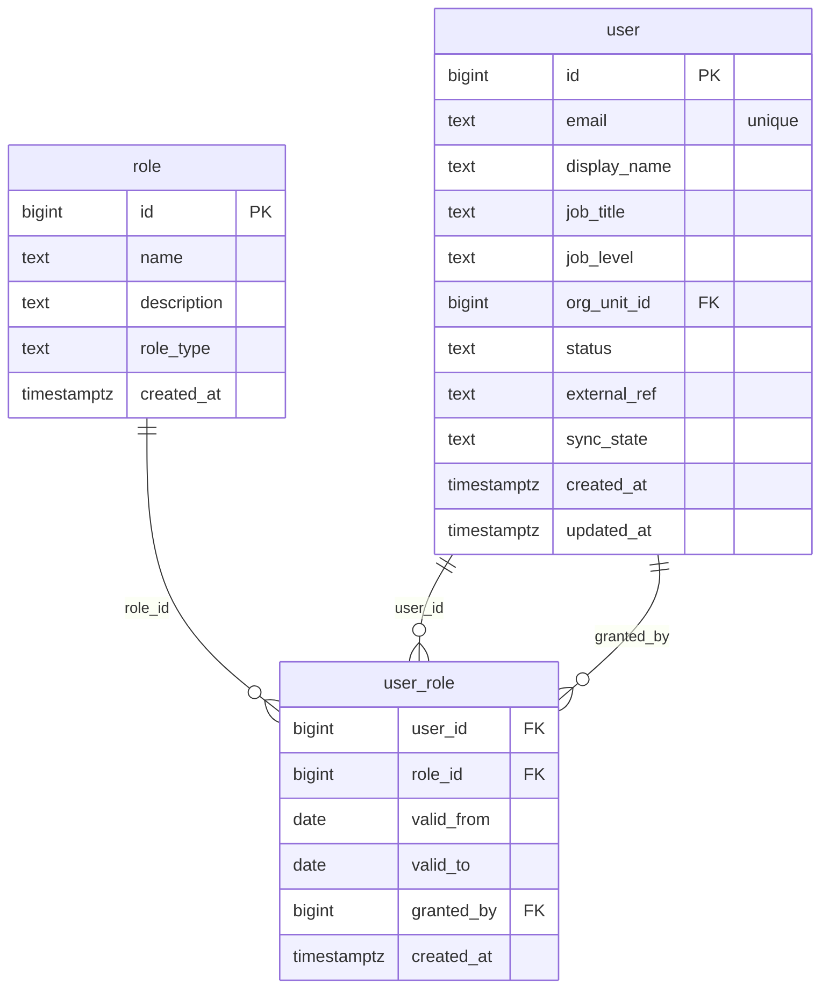

# `table-user_role.md` — user_role  (domain: Identity & Org)

Focused local-context view of the **user_role** table and its immediate FK neighbors.

## Mini ER diagram

## Relationships

**Outbound (this table → target via column):**
- `user_role.user_id` → `user.id` (N:1)
- `user_role.role_id` → `role.id` (N:1)
- `user_role.granted_by` → `user.id` (N:1)

## Notes

Effective-dated many-to-many between user and role.
