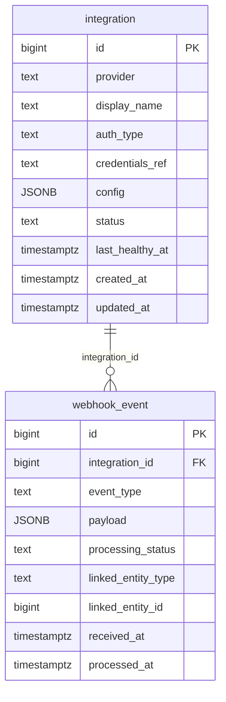

# `table-webhook_event.md` — webhook_event  (domain: Integration)

Focused local-context view of the **webhook_event** table and its immediate FK neighbors.

## Mini ER diagram

## Relationships

**Outbound (this table → target via column):**
- `webhook_event.integration_id` → `integration.id` (N:1)

## Notes

A received webhook payload with processing status.
